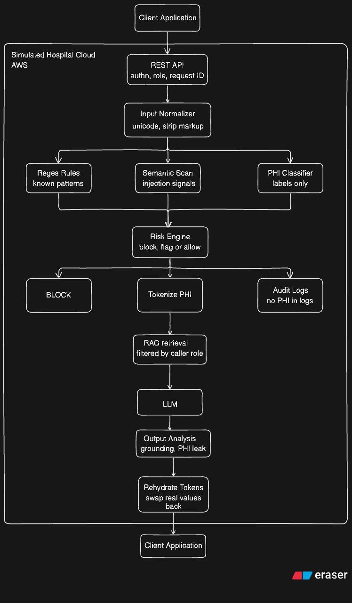

# ScrubX
ScrubX is a security gateway that sits between a clinical app and an LLM. A doctor's question passes through it, sensitive patient details get swapped for tokens before anything reaches the model, and the real values get swapped back into the answer on the way out. Every request leaves an audit trail, and risky ones never make it past the gate. I am building so i can **simulate how hospitals can use an LLM without sending patient data** anywhere it shouldn't go.

## System Architecture(Proposed):
ScrubX runs as a single service with a staged pipeline i.e. normalize, detect, decide, tokenize, call and restore. Each stage is a module behind its own interface, so anyone can be swapped or pulled into its own service without touching the others. Audit writes happen off the request path.

